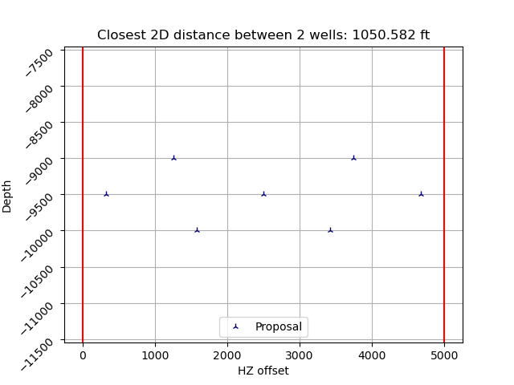
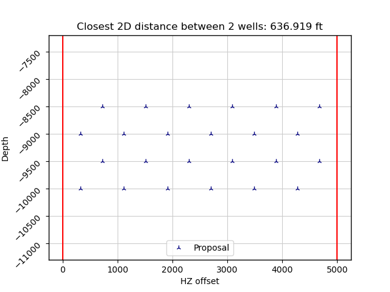
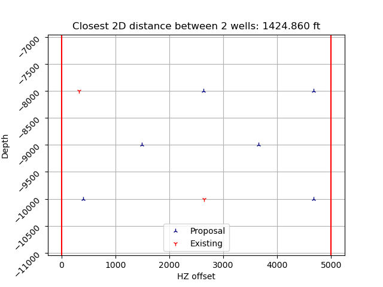

# Gunbarrel-Optimizer

Python3 2D spatial optimizer to propose wells in the [popular gunbarrel view stacked orientation](./img/gunbarrel.png). Uses `scipy.optimize` under the hood.

Proposals account for user-specified constraints, including:
- `num_zones`: count of depth intervals, zones, to add
- `well_counts`: counts of wells in each zone to add
- `depths`: true vertical depths of each zone
- `existing_wells`: (x, y) tuples representing existing wells locations to account
- `lease_offset`: horizontal distance to maintain from edges of lease
- `right_bount`: horizontal extent of lease

Beyond above constraints, algorithm maximizes distance between wells (both existing as well as other proposed wells).

# Examples

<em> The below examples use a horizontal bound of [0, 5000] and lease offset of 330. </em>

|   | 
|:--:| 
| 2/3/2 orientation (differential evolution)   <em> (note top and bottom zones are intentionally non-vertically aligned) </em> |

|   | 
|:--:| 
| 6/6/6/6 orientation |

|   | 
|:--:| 
| 3/2/3 orientation with 2 existing wells (basinhopping) |
